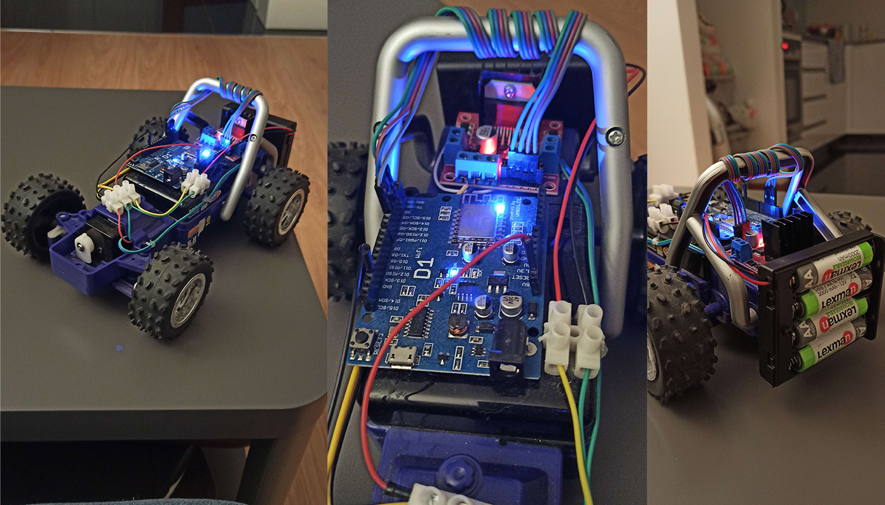

# WifiCar

I decided to recycle my old remote controlled car. The battery is dead and i lost the remote controller which is perfect for this project :D

#### Initial idea: 
*Build a wifi socket controlled old rc car through a hosted webpage so we can use in any device using a browser*
  
##### Components used:
- Wemos D1 R1 arduino
- L298N module for controlling the motors
- 4xAA rechargeable battery pack

##### Webpage:
- npm install
- Change IP of arduino in index.html: 
  - var connection = new WebSocket("ws://<IP>/ws", ["arduino"])
- node wificar.js
*It will be hosted at localhost:1707

#### Build:

#### Short clip
